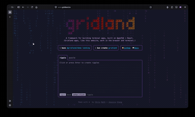

# Gridland

[](https://github.com/thoughtfulllc/gridland/actions/workflows/test.yml)

Build terminal apps that run in the browser (and the terminal) with React. The [Gridland website](https://www.gridland.io) is built with Gridland.

Gridland is built on the [OpenTUI](https://opentui.com) rendering engine.



## Quick Start

Create a new project:

```bash
bunx create-gridland my-app
```

> **Note:** Terminal apps require [Bun](https://bun.sh) to run in development. However, you can [compile to a standalone binary](#compile-to-binary) that requires no runtime at all — users don't need Bun, Node, or npm installed.

## Try the Demos

Run interactive demos in your terminal:

```bash
bunx @gridland/demo landing
bunx @gridland/demo gradient
bunx @gridland/demo chat
```

## Add to an Existing Project

### Vite

```bash
bun add @gridland/web
```

```ts
// vite.config.ts
import { gridlandWebPlugin } from "@gridland/web/vite-plugin";

export default defineConfig({
  plugins: [gridlandWebPlugin()],
});
```

### Next.js

```bash
bun add @gridland/web
```

```ts
// next.config.ts
import { withGridland } from "@gridland/web/next-plugin";

export default withGridland({});
```

## Components

UI components are distributed via a [shadcn](https://ui.shadcn.com) registry. Install them individually so you own the code:

```bash
bunx shadcn@latest add @gridland/chat
bunx shadcn@latest add @gridland/spinner
bunx shadcn@latest add @gridland/table
```

## Sandboxed Execution

Run any app in an isolated Docker container:

```bash
bunx @gridland/container @gridland/demo -- landing
```

Supports npm packages, GitHub repos, and local directories as sources.

## Compile to Binary

Build a standalone executable with no runtime required:

```bash
bun build --compile src/cli.tsx --outfile my-app
```

## Packages

| Package | Description |
|---------|-------------|
| [`@gridland/web`](https://www.npmjs.com/package/@gridland/web) | Core canvas renderer and React integration |
| [`@gridland/utils`](https://www.npmjs.com/package/@gridland/utils) | Portable hooks (useKeyboard, useTerminalDimensions) |
| [`@gridland/bun`](https://www.npmjs.com/package/@gridland/bun) | Bun-native runtime for CLI apps |
| [`@gridland/ui`](https://www.npmjs.com/package/@gridland/ui) | Pre-built UI components via shadcn registry |
| [`@gridland/testing`](https://www.npmjs.com/package/@gridland/testing) | Test utilities for TUI components |
| [`@gridland/demo`](https://www.npmjs.com/package/@gridland/demo) | Interactive demo runner |
| [`@gridland/container`](https://www.npmjs.com/package/@gridland/container) | Docker sandbox runner |

## Documentation

Full docs at [gridland.io/docs](https://gridland.io/docs)

---

Made with ❤️ by [Chris Roth](https://cjroth.com) and [Jessica Cheng](https://jessicacheng.studio)
